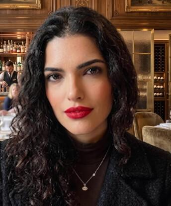

<!--
=============================================================================
SITE COMPLETO - THEODORA LUCAS HOLZ

ESTE É O ÚNICO ARQUIVO QUE VOCÊ PRECISA EDITAR.

COMO EDITAR:
1. Procure o texto que deseja alterar.
2. Edite a versão em português dentro de class="lang-pt".
3. Edite a versão em inglês dentro de class="lang-en".
4. Salve com Ctrl + S.

FOTO PRINCIPAL:
Substitua o arquivo images/perfil.jpg, mantendo o mesmo nome.

CORES:
Procure a seção "CORES DO SITE" abaixo.
=============================================================================
-->

```{=html}
<style>
/* ==========================================================================
   CORES DO SITE
   Altere somente os códigos depois dos dois-pontos, se desejar.
   ========================================================================== */
:root {
  --background: #f7f3ea;
  --surface: #fffdf8;
  --surface-soft: #eee8dc;
  --text: #252525;
  --text-soft: #605e59;
  --primary: #1f4d4a;
  --primary-soft: #dbe7e3;
  --accent: #c9a227;
  --border: #d8d2c4;
  --shadow: rgba(31, 77, 74, 0.14);
}

html[data-theme="dark"] {
  --background: #111918;
  --surface: #192321;
  --surface-soft: #24302e;
  --text: #f4f0e7;
  --text-soft: #c9c5bd;
  --primary: #80b8ae;
  --primary-soft: #263d39;
  --accent: #dfbd4a;
  --border: #3b4b48;
  --shadow: rgba(0, 0, 0, 0.35);
}

/* ==========================================================================
   APARÊNCIA GERAL
   ========================================================================== */
@import url("https://fonts.googleapis.com/css2?family=Merriweather:wght@400;700&family=Source+Sans+3:wght@400;500;600;700&display=swap");

html { scroll-behavior: smooth; }

body {
  margin: 0;
  background: var(--background);
  color: var(--text);
  font-family: "Source Sans 3", "Segoe UI", sans-serif;
  font-size: 18px;
  line-height: 1.7;
  transition: background .25s ease, color .25s ease;
}

#quarto-document-content,
#quarto-content,
main.content {
  margin: 0 !important;
  padding: 0 !important;
  max-width: none !important;
}

#title-block-header { display: none; }

h1, h2, h3 {
  color: var(--primary);
  font-family: "Merriweather", Georgia, serif;
  line-height: 1.2;
}

h2 { font-size: clamp(1.8rem, 4vw, 2.6rem); margin-bottom: 1.5rem; }
h3 { font-size: 1.18rem; }
a { color: var(--primary); }

.site-shell { min-height: 100vh; }
.container { width: min(1120px, calc(100% - 40px)); margin: 0 auto; }

.site-header {
  position: sticky;
  top: 0;
  z-index: 50;
  background: color-mix(in srgb, var(--background) 92%, transparent);
  border-bottom: 1px solid var(--border);
  backdrop-filter: blur(14px);
}

.header-inner {
  min-height: 72px;
  display: flex;
  align-items: center;
  justify-content: space-between;
  gap: 1rem;
}

.brand {
  color: var(--primary);
  font-family: "Merriweather", Georgia, serif;
  font-size: 1.12rem;
  font-weight: 700;
  text-decoration: none;
  white-space: nowrap;
}

.nav-links { display: flex; align-items: center; gap: 1.15rem; }
.nav-links a {
  color: var(--text);
  font-size: .92rem;
  font-weight: 600;
  text-decoration: none;
}
.nav-links a:hover { color: var(--accent); }

.controls { display: flex; align-items: center; gap: .5rem; }
.control-button {
  min-width: 44px;
  min-height: 40px;
  padding: .45rem .7rem;
  color: var(--text);
  background: var(--surface);
  border: 1px solid var(--border);
  border-radius: 999px;
  cursor: pointer;
  font: inherit;
  font-size: .84rem;
  font-weight: 700;
}
.control-button:hover { border-color: var(--accent); }

.hero {
  min-height: 76vh;
  display: grid;
  grid-template-columns: minmax(240px, 350px) 1fr;
  gap: clamp(2.5rem, 7vw, 6rem);
  align-items: center;
  padding: 5rem 0;
}

.hero-photo {
  display: block;
  width: 100%;
  aspect-ratio: 4 / 5;
  object-fit: cover;
  object-position: center top;
  border-radius: 1.4rem;
  box-shadow: 18px 18px 0 var(--border);
}

.eyebrow {
  color: var(--accent);
  font-size: .82rem;
  font-weight: 700;
  letter-spacing: .14em;
  text-transform: uppercase;
}

.hero h1 {
  margin: .7rem 0 1rem;
  font-size: clamp(2.8rem, 7vw, 5.4rem);
  line-height: 1.02;
}

.hero-lead {
  max-width: 760px;
  color: var(--text-soft);
  font-size: clamp(1.12rem, 2vw, 1.38rem);
}

.accent-rule {
  width: 4.2rem;
  margin: 1.3rem 0;
  border-top: 4px solid var(--accent);
}

.button-row { display: flex; flex-wrap: wrap; gap: .8rem; margin-top: 1.7rem; }
.site-button {
  display: inline-block;
  padding: .72rem 1.15rem;
  color: var(--primary);
  border: 1px solid var(--primary);
  border-radius: 999px;
  font-weight: 700;
  text-decoration: none;
}
.site-button.primary { color: var(--background); background: var(--primary); }
.site-button:hover { color: #252525; background: var(--accent); border-color: var(--accent); }

.content-section {
  padding: 5.5rem 0;
  border-top: 1px solid var(--border);
}
.content-section.alt { background: var(--surface-soft); }
.section-intro { max-width: 820px; color: var(--text-soft); font-size: 1.08rem; }

.card-grid {
  display: grid;
  grid-template-columns: repeat(3, 1fr);
  gap: 1.2rem;
  margin-top: 2rem;
}

.info-card {
  padding: 1.55rem;
  background: var(--surface);
  border: 1px solid var(--border);
  border-radius: 1rem;
  box-shadow: 0 8px 30px var(--shadow);
}
.info-card h3 { margin-top: 0; }

.timeline { margin-top: 2rem; padding-left: 1.5rem; border-left: 2px solid var(--accent); }
.timeline-item { position: relative; margin-bottom: 2.3rem; }
.timeline-item::before {
  content: "";
  position: absolute;
  left: -1.91rem;
  top: .42rem;
  width: .72rem;
  height: .72rem;
  background: var(--primary);
  border: 3px solid var(--background);
  border-radius: 50%;
}
.alt .timeline-item::before { border-color: var(--surface-soft); }
.timeline-item h3 { margin-bottom: .25rem; }
.meta { color: var(--text-soft); font-size: .94rem; font-weight: 700; }

.tag-list { margin-top: 1.4rem; }
.tag {
  display: inline-block;
  margin: .22rem;
  padding: .26rem .68rem;
  background: var(--primary-soft);
  border-radius: 999px;
  font-size: .9rem;
  font-weight: 600;
}

.contact-grid {
  display: grid;
  grid-template-columns: repeat(3, 1fr);
  gap: 1rem;
  margin-top: 2rem;
}

.site-footer {
  padding: 2rem 0;
  color: var(--text-soft);
  text-align: center;
  border-top: 1px solid var(--border);
}

.lang-en { display: none; }
html[data-language="en"] .lang-pt { display: none !important; }
html[data-language="en"] .lang-en { display: revert !important; }
html[data-language="en"] span.lang-en,
html[data-language="en"] a.lang-en { display: inline !important; }

@media (max-width: 900px) {
  .nav-links { display: none; }
  .hero { grid-template-columns: 1fr; min-height: auto; padding: 3.5rem 0; }
  .hero-photo { max-width: 330px; }
  .card-grid, .contact-grid { grid-template-columns: 1fr; }
}

@media (max-width: 520px) {
  .container { width: min(100% - 28px, 1120px); }
  .brand { max-width: 150px; white-space: normal; line-height: 1.15; }
  .hero h1 { font-size: 2.65rem; }
}
</style>

<div class="site-shell">

<header class="site-header">
  <div class="container header-inner">
    <a class="brand" href="#inicio">Theodora Lucas Holz</a>

    <nav class="nav-links" aria-label="Navegação principal">
      <a href="#sobre"><span class="lang-pt">Sobre</span><span class="lang-en">About</span></a>
      <a href="#pesquisa"><span class="lang-pt">Pesquisa</span><span class="lang-en">Research</span></a>
      <a href="#publicacoes"><span class="lang-pt">Publicações</span><span class="lang-en">Publications</span></a>
      <a href="#ensino"><span class="lang-pt">Ensino</span><span class="lang-en">Teaching</span></a>
      <a href="#contato"><span class="lang-pt">Contato</span><span class="lang-en">Contact</span></a>
    </nav>

    <div class="controls">
      <button id="language-toggle" class="control-button" type="button" aria-label="Alterar idioma">EN</button>
      <button id="theme-toggle" class="control-button" type="button" aria-label="Alterar tema">☾</button>
    </div>
  </div>
</header>

<main>

<!-- ======================================================================
     PÁGINA INICIAL / HOME
     ====================================================================== -->
<section id="inicio">
  <div class="container hero">
    

    <div>
      <div class="eyebrow lang-pt">Marketing · Inteligência Artificial · Sustentabilidade</div>
      <div class="eyebrow lang-en">Marketing · Artificial Intelligence · Sustainability</div>

      <h1>Theodora Lucas Holz</h1>
      <div class="accent-rule"></div>

      <p class="hero-lead lang-pt">
        Doutoranda em Administração na UFRGS, pesquisando inteligência artificial
        frugal, sistemas de recomendação, place marketing e decisão orientada por dados.
      </p>
      <p class="hero-lead lang-en">
        PhD student in Business Administration at UFRGS, researching frugal artificial
        intelligence, recommendation systems, place marketing and data-driven decision-making.
      </p>

      <div class="button-row">
        <a class="site-button primary" href="#pesquisa">
          <span class="lang-pt">Conheça minha pesquisa</span>
          <span class="lang-en">Explore my research</span>
        </a>
        <a class="site-button" href="arquivos/curriculo-lattes-theodora-holz.pdf">
          <span class="lang-pt">Baixar currículo</span>
          <span class="lang-en">Download CV</span>
        </a>
      </div>
    </div>
  </div>
</section>

<!-- ======================================================================
     SOBRE / ABOUT
     ====================================================================== -->
<section id="sobre" class="content-section alt">
  <div class="container">
    <div class="lang-pt">
      <h2>Sobre mim</h2>
      <p class="section-intro">
        Sou doutoranda em Administração pela Universidade Federal do Rio Grande do Sul
        (UFRGS), mestre em Administração e bacharela em Administração pela Universidade
        Federal do Rio Grande (FURG).
      </p>
      <p class="section-intro">
        Minha pesquisa conecta marketing, inteligência artificial, sistemas de recomendação,
        inteligência territorial e uso estratégico de dados. Tenho experiência em pesquisa,
        análise de dados, produção acadêmica e apoio ao ensino superior.
      </p>
    </div>

    <div class="lang-en">
      <h2>About me</h2>
      <p class="section-intro">
        I am a PhD student in Business Administration at the Federal University of Rio Grande
        do Sul (UFRGS), with a Master's and a Bachelor's degree in Business Administration
        from the Federal University of Rio Grande (FURG).
      </p>
      <p class="section-intro">
        My research connects marketing, artificial intelligence, recommendation systems,
        territorial intelligence and the strategic use of data. I have experience in research,
        data analysis, academic production and higher education support.
      </p>
    </div>

    <div class="timeline">
      <div class="timeline-item">
        <div class="lang-pt">
          <h3>Doutorado em Administração</h3>
          <div class="meta">UFRGS · 2025–atual</div>
          <p><strong>Tese:</strong> Frugal Intelligence in Place Marketing<br>
          <strong>Orientador:</strong> Vinicius Andrade Brei · <strong>Bolsa:</strong> CAPES</p>
        </div>
        <div class="lang-en">
          <h3>PhD in Business Administration</h3>
          <div class="meta">UFRGS · 2025–present</div>
          <p><strong>Dissertation:</strong> Frugal Intelligence in Place Marketing<br>
          <strong>Advisor:</strong> Vinicius Andrade Brei · <strong>Scholarship:</strong> CAPES</p>
        </div>
      </div>

      <div class="timeline-item">
        <div class="lang-pt">
          <h3>Mestrado em Administração</h3>
          <div class="meta">FURG · 2023–2025</div>
          <p><strong>Dissertação:</strong> Inteligência Artificial e Desempenho Bancário:
          Evidências do Mercado Brasileiro (2013–2023).</p>
        </div>
        <div class="lang-en">
          <h3>Master's in Business Administration</h3>
          <div class="meta">FURG · 2023–2025</div>
          <p><strong>Thesis:</strong> Artificial Intelligence and Banking Performance:
          Evidence from the Brazilian Market (2013–2023).</p>
        </div>
      </div>

      <div class="timeline-item">
        <div class="lang-pt">
          <h3>Bacharelado em Administração</h3>
          <div class="meta">FURG · 2019–2023</div>
          <p>Pesquisa sobre confiança, influenciadores digitais, celebridades e intenção de compra.</p>
        </div>
        <div class="lang-en">
          <h3>Bachelor's in Business Administration</h3>
          <div class="meta">FURG · 2019–2023</div>
          <p>Research on trust, digital influencers, celebrities and purchase intention.</p>
        </div>
      </div>
    </div>
  </div>
</section>

<!-- ======================================================================
     PESQUISA / RESEARCH
     ====================================================================== -->
<section id="pesquisa" class="content-section">
  <div class="container">
    <div class="lang-pt">
      <h2>Pesquisa</h2>
      <p class="section-intro">
        Minha agenda investiga como tecnologias e dados podem apoiar decisões relevantes,
        eficientes e sustentáveis em marketing e gestão.
      </p>
    </div>
    <div class="lang-en">
      <h2>Research</h2>
      <p class="section-intro">
        My research investigates how technologies and data can support relevant, efficient
        and sustainable decisions in marketing and management.
      </p>
    </div>

    <div class="card-grid">
      <article class="info-card">
        <div class="lang-pt">
          <h3>Inteligência artificial frugal</h3>
          <p>Soluções rigorosas e eficientes, conscientes do uso de recursos computacionais.</p>
        </div>
        <div class="lang-en">
          <h3>Frugal artificial intelligence</h3>
          <p>Rigorous and efficient solutions that consider computational resource use.</p>
        </div>
      </article>

      <article class="info-card">
        <div class="lang-pt">
          <h3>Sistemas de recomendação</h3>
          <p>Agentes de recomendação territorial aplicados ao place marketing e à decisão.</p>
        </div>
        <div class="lang-en">
          <h3>Recommendation systems</h3>
          <p>Territorial recommendation agents applied to place marketing and decision-making.</p>
        </div>
      </article>

      <article class="info-card">
        <div class="lang-pt">
          <h3>Marketing e desempenho</h3>
          <p>Marketing analytics, transformação digital, métricas e desempenho bancário.</p>
        </div>
        <div class="lang-en">
          <h3>Marketing and performance</h3>
          <p>Marketing analytics, digital transformation, metrics and banking performance.</p>
        </div>
      </article>
    </div>

    <div class="tag-list">
      <span class="tag">Frugal AI</span>
      <span class="tag">Recommendation systems</span>
      <span class="tag">Place marketing</span>
      <span class="tag">Marketing analytics</span>
      <span class="tag">R</span>
      <span class="tag">Python</span>
    </div>
  </div>
</section>

<!-- ======================================================================
     PUBLICAÇÕES / PUBLICATIONS
     EDITE OU DUPLIQUE OS BLOCOS ABAIXO PARA ADICIONAR TRABALHOS.
     ====================================================================== -->
<section id="publicacoes" class="content-section alt">
  <div class="container">
    <div class="lang-pt">
      <h2>Publicações e trabalhos</h2>
      <p class="section-intro">Projetos e trabalhos acadêmicos selecionados.</p>
    </div>
    <div class="lang-en">
      <h2>Publications and working papers</h2>
      <p class="section-intro">Selected research projects and academic work.</p>
    </div>

    <div class="card-grid">
      <article class="info-card">
        <h3>Frugal Intelligence in Place Marketing</h3>
        <p class="lang-pt">Projeto de tese em desenvolvimento sobre agentes de recomendação territorial.</p>
        <p class="lang-en">Ongoing dissertation project on territorial recommendation agents.</p>
      </article>

      <article class="info-card">
        <h3 class="lang-pt">Inteligência Artificial e Desempenho Bancário</h3>
        <h3 class="lang-en">Artificial Intelligence and Banking Performance</h3>
        <p class="lang-pt">Evidências do mercado brasileiro entre 2013 e 2023.</p>
        <p class="lang-en">Evidence from the Brazilian market between 2013 and 2023.</p>
      </article>

      <article class="info-card">
        <h3 class="lang-pt">Confiança e intenção de compra</h3>
        <h3 class="lang-en">Trust and purchase intention</h3>
        <p class="lang-pt">Influenciadores digitais, celebridades e comportamento do consumidor.</p>
        <p class="lang-en">Digital influencers, celebrities and consumer behavior.</p>
      </article>
    </div>
  </div>
</section>

<!-- ======================================================================
     ENSINO / TEACHING
     ====================================================================== -->
<section id="ensino" class="content-section">
  <div class="container">
    <div class="lang-pt">
      <h2>Ensino</h2>
      <p class="section-intro">
        Interesses de ensino em métodos quantitativos, marketing, análise de dados,
        inteligência artificial e sistemas de recomendação.
      </p>
    </div>
    <div class="lang-en">
      <h2>Teaching</h2>
      <p class="section-intro">
        Teaching interests in quantitative methods, marketing, data analysis,
        artificial intelligence and recommendation systems.
      </p>
    </div>

    <div class="card-grid">
      <article class="info-card">
        <h3 class="lang-pt">Métodos e dados</h3>
        <h3 class="lang-en">Methods and data</h3>
        <p>R · Python · Statistics · Data analysis</p>
      </article>
      <article class="info-card">
        <h3>Marketing</h3>
        <p>Consumer behavior · Marketing analytics · Place marketing</p>
      </article>
      <article class="info-card">
        <h3 class="lang-pt">Inteligência artificial</h3>
        <h3 class="lang-en">Artificial intelligence</h3>
        <p>Frugal AI · Prompting · Recommendation systems</p>
      </article>
    </div>
  </div>
</section>

<!-- ======================================================================
     CONTATO / CONTACT
     TROQUE O E-MAIL E O LINKEDIN NOS DOIS IDIOMAS.
     ====================================================================== -->
<section id="contato" class="content-section alt">
  <div class="container">
    <div class="lang-pt">
      <h2>Contato</h2>
      <p class="section-intro">
        Tenho interesse em colaborações sobre marketing, inteligência artificial,
        sustentabilidade, métodos quantitativos e aplicações organizacionais de dados.
      </p>
    </div>
    <div class="lang-en">
      <h2>Contact</h2>
      <p class="section-intro">
        I welcome collaborations in marketing, artificial intelligence, sustainability,
        quantitative methods and organizational data applications.
      </p>
    </div>

    <div class="contact-grid">
      <article class="info-card">
        <h3>E-mail</h3>
        <a href="mailto:theodora.holz@gmail.com">theodora.holz@gmail.com</a>
      </article>
      <article class="info-card">
        <h3>ORCID</h3>
        <a href="https://orcid.org/0000-0002-9252-7584">0000-0002-9252-7584</a>
      </article>
      <article class="info-card">
        <h3>Lattes</h3>
        <a href="http://lattes.cnpq.br/3464507233871483">Currículo Lattes</a>
      </article>
    </div>
  </div>
</section>

</main>

<footer class="site-footer">
  <div class="container">
    © 2026 Theodora Lucas Holz ·
    <span class="lang-pt">Desenvolvido com Quarto</span>
    <span class="lang-en">Built with Quarto</span>
  </div>
</footer>

</div>

<script>
(function () {
  const root = document.documentElement;
  const languageButton = document.getElementById("language-toggle");
  const themeButton = document.getElementById("theme-toggle");

  const savedLanguage = localStorage.getItem("site-language") || "pt";
  const savedTheme = localStorage.getItem("site-theme") ||
    (window.matchMedia("(prefers-color-scheme: dark)").matches ? "dark" : "light");

  function setLanguage(language) {
    root.dataset.language = language;
    root.lang = language === "pt" ? "pt-BR" : "en";
    languageButton.textContent = language === "pt" ? "EN" : "PT";
    languageButton.setAttribute(
      "aria-label",
      language === "pt" ? "View site in English" : "Ver site em português"
    );
    localStorage.setItem("site-language", language);
  }

  function setTheme(theme) {
    root.dataset.theme = theme;
    themeButton.textContent = theme === "light" ? "☾" : "☀";
    themeButton.setAttribute(
      "aria-label",
      theme === "light" ? "Ativar tema escuro" : "Ativar tema claro"
    );
    localStorage.setItem("site-theme", theme);
  }

  languageButton.addEventListener("click", function () {
    setLanguage(root.dataset.language === "pt" ? "en" : "pt");
  });

  themeButton.addEventListener("click", function () {
    setTheme(root.dataset.theme === "light" ? "dark" : "light");
  });

  setLanguage(savedLanguage);
  setTheme(savedTheme);
})();
</script>
```
